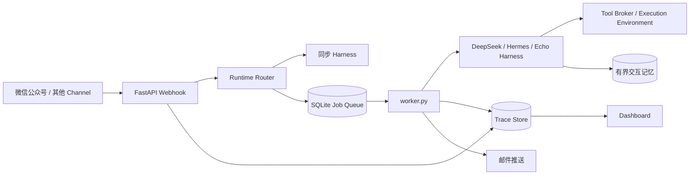

# self_modifying_bot（自进化 Bot）

微信公众号消息网关和通用 Agent channel。它把微信等消息协议与 Agent runtime 解耦，默认选择 DeepSeek，可切换 Hermes，并为后续自进化能力保留持久化配置和记忆目录。

运行时配置位于用户目录 `%USERPROFILE%\\.self_modifying_bot\\`，项目目录不保存运行时密钥和配置。

## 本地运行

```powershell
py -m venv .venv
.\.venv\Scripts\Activate.ps1
pip install -r requirements.txt
New-Item -ItemType Directory -Force "$HOME\\.self_modifying_bot" | Out-Null
Copy-Item config.toml.example "$HOME\\.self_modifying_bot\\config.toml"
Copy-Item .env.example "$HOME\\.self_modifying_bot\\.env"
# 一条命令初始化授权（首次运行）并启动 Web 服务和 Worker
.\restart.ps1
```

Worker 完成任务后会通过已配置的 QQ SMTP 推送邮件到 `notification_recipient`；邮件发送失败不影响 `/task` 查询。可在用户目录配置中关闭：

```toml
[agent]
notification_recipient = "your@example.com"
notification_enabled = true
```

默认 runtime 是 `deepseek_harness`，可在用户目录的 `config.toml` 中改为 `hermes_agent` 或 `echo`。DeepSeek runtime 需要安装并配置对应 Harness/模型凭据；未就绪时会安全回退为回声回复。微信公众号长任务由 `worker.py` 执行，用户通过 `/task <任务号>` 查询结果。

以后可使用 `restart.ps1` 重启本地服务。它会自动检查邮件授权配置；只有首次未配置时才会要求输入 QQ SMTP 授权码：

```powershell
.\restart.ps1
```

首次运行 `restart.ps1` 时会初始化 QQ 邮件推送，交互输入发件邮箱和 SMTP 授权码；凭据保存在 `%USERPROFILE%\.self_modifying_bot\push-notification\`，授权码使用当前 Windows 用户加密。后续启动检测到配置后会直接继续。如需更换发件邮箱或授权码，运行：

```powershell
.\skills\push-notification\scripts\start-push-service.ps1 -Force
```

生产环境请使用 HTTPS 反向代理，并将微信公众号后台的服务器 URL 指向 `/wechat`。

## 整体架构

项目把“消息接入、运行时选择、任务执行、通知和观测”拆成独立层，详细设计见 [`docs/architecture.md`](docs/architecture.md) 和 [`docs/implementation-plan.md`](docs/implementation-plan.md)。核心链路如下：



一次请求的处理顺序是：Channel 验证并接收消息；Router 根据会话配置选择 Harness；简单问题同步返回；复杂问题先确认通知邮箱，再写入 SQLite 队列；Worker 执行后保存结果并通过邮件通知；所有关键阶段写入 Trace，便于在 Dashboard 中定位失败环节。Harness 只能通过统一的 Tool Broker 使用工具，执行环境和策略层负责隔离权限，避免某个 Harness 直接突破项目安全边界。

主要模块职责：

- `app.py`：Webhook、命令解析、同步响应、任务创建和 Dashboard API。
- `jobs.py`：会话状态、任务队列、结果查询和通知邮箱。
- `worker.py`：后台任务消费、Harness 调用、失败重试和结果推送。
- `harness_runtime.py`：可插拔 Runtime 适配，支持 DeepSeek、Hermes 和 Echo 回退。
- `observability.py`：Trace、失败事件和健康度统计。
- `skills/`：可复用的初始化、推送和构建能力；不会把运行时密钥写入代码目录。

## 可观测性

每个请求都会生成 `trace_id`，并记录接收、路由、入队、执行、完成或失败等事件。Dashboard 提供最近事件、失败列表、Trace 详情和运行时健康度；对应 API 是 `/api/observability/summary`、`/api/observability/failures`、`/api/observability/traces` 和 `/api/observability/traces/{trace_id}`。完整方案见 [`docs/observability-plan.md`](docs/observability-plan.md)。

## 用户交互命令

微信公众号中可以使用以下命令控制会话，而不需要每轮自动切换 Runtime：

```text
/harness status              查看当前 Harness
/harness use deepseek_harness  主动切换 Harness
/email status                查看结果通知邮箱
/email set your@example.com  设置异步结果接收邮箱
/task <任务号>                查询后台任务结果
```

复杂请求在入队前必须先设置邮箱，机器人会先提示用户，不会在缺少通知地址时重复创建任务。微信网页会话结束后，后台结果仍可通过邮件和 `/task` 查询；消息推送与队列设计见 [`docs/wechat-async-delivery.md`](docs/wechat-async-delivery.md)。

## 文档导航

- [`docs/architecture.md`](docs/architecture.md)：整体分层、数据流和安全边界。
- [`docs/implementation-plan.md`](docs/implementation-plan.md)：落地模块、配置和实施顺序。
- [`docs/controlled-learning-design.md`](docs/controlled-learning-design.md)：可控自进化、记忆和审批机制。
- [`docs/harness-self-evolution-research.md`](docs/harness-self-evolution-research.md)：DeepSeek Harness、Hermes 和 Prime Agent 调研。
- [`docs/wechat-async-delivery.md`](docs/wechat-async-delivery.md)：微信响应、后台队列和邮件推送。
- [`docs/observability-plan.md`](docs/observability-plan.md)：Trace、Dashboard 和故障定位。
- [`skills/build-self-modifying-bot/SKILL.md`](skills/build-self-modifying-bot/SKILL.md)：初始化、构建和启动流程。

## 配置

非敏感配置保存在 `%USERPROFILE%\\.self_modifying_bot\\config.toml`；API Key 等密钥保存在同目录的 `.env`。默认模型提供方是 `deepseek-official`，模型是 `deepseek-chat`。

自进化能力当前采用有界交互记忆：最近经验写入 `%USERPROFILE%\\.self_modifying_bot\\memory.jsonl` 并提供给后续同一会话。它不会自动修改源代码或安全策略；未来的代码进化应增加独立审批和回滚机制。

## 安全边界

当前版本不会执行用户提供的 shell 命令，也不会把 Codex CLI 直接作为公网 HTTP 服务。需要执行代码或文件任务时，应另加受限的后台 worker、工作目录和人工确认流程。
