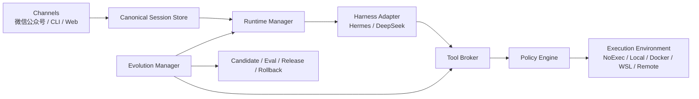
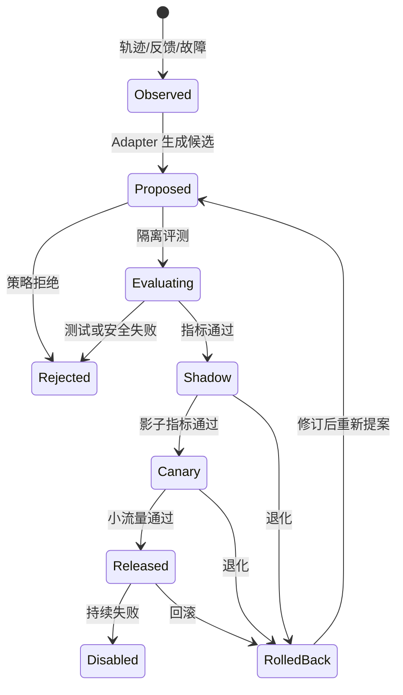
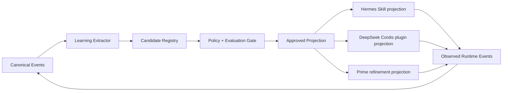

# Self Modifying Bot 架构方案

## 1. 目标

`self_modifying_bot` 是一个与渠道、Agent Harness、模型和执行环境解耦的机器人控制层。微信公众号只是第一个 Channel；DeepSeek Harness、Hermes Agent 与 Prime Agent 是首批 Runtime；DeepSeek 是默认模型，但都可通过配置或 CLI 替换。

“自进化”不等于让公网消息直接修改正在运行的程序。这里将它定义为一条可审计、可测试、可发布、可回滚的改进流水线：观察问题，形成候选修改，在隔离环境中评估，经策略批准后分阶段发布。

用户配置、会话和演化记录应位于用户目录，而不是源码目录：

```text
~/.self_modifying_bot/
├── config.toml
├── secrets.env
├── sessions/
├── runtimes/
├── environments/
├── candidates/
├── releases/
└── logs/
```

源码目录可以被升级或替换，用户状态仍然保留。

## 2. 控制面与执行面



控制面负责渠道凭据、会话、运行时选择、策略、审计、候选版本和回滚，通常运行在可信宿主机。执行面承载文件操作、命令、浏览器等有副作用工具，可按用户或会话放进不同隔离环境。

沙箱只能约束执行面，不能成为唯一控制层。否则一个沙箱内的 Agent 既无法可靠升级控制器，也可能在升级时破坏自己的状态。控制层应保持最小、稳定和可恢复；自进化产生的是候选版本，而不是原地改写当前进程。

## 3. Channel 是通用入口

Channel Adapter 只负责：

- 验签、解密、限流和消息规范化；
- 将渠道身份映射为内部主体；
- 把标准回复转换为渠道格式；
- 处理渠道超时，例如微信公众号先快速响应，再通过允许的客服消息机制异步回复。

Channel 不直接调用 Harness 的私有 API，也不拥有 shell 权限。来自公众号的普通用户默认使用 `NoExec`；只有显式授权的身份才能绑定受限沙箱，管理员模式仍需高风险操作审批。

## 4. Harness Runtime 可插拔

每个 Harness 通过 Adapter 实现稳定协议：

```text
discover() -> RuntimeMetadata
install(version) -> InstalledRuntime
health_check() -> HealthReport
start(session_snapshot, tool_endpoint) -> RuntimeHandle
send_turn(handle, message) -> EventStream
checkpoint(handle) -> RuntimeCheckpoint
stop(handle) -> None
```

CLI 建议提供：

```text
selfbot runtime list
selfbot runtime discover
selfbot runtime install hermes-agent
selfbot runtime install deepseek-harness
selfbot runtime use deepseek-harness
selfbot runtime status
selfbot runtime rollback
```

发现顺序为：显式配置路径、常见 `WORKSPACE` 路径、PATH/已安装包、托管目录 `~/.self_modifying_bot/runtimes/`。若未安装，CLI 展示来源、版本和权限，经用户确认后下载到隔离目录；使用固定版本和校验值，安装完成后先健康检查再切换。安装失败时继续使用旧 Runtime 或退化到内置无工具对话模式。

Runtime 不会每轮自动切换。用户通过 `/harness use <name>` 或管理员 CLI 主动请求后，切换只在当前一轮消息结束时发生；这个限制是为了避免中断正在生成的回复或工具调用。Bot 自己维护规范会话日志，包括消息、摘要、任务、产物、工具结果引用和环境事件；Harness 的原生 session id 只是可选映射。新 Runtime 由受限长度的历史、结构化摘要和未完成任务重建上下文。启动或恢复失败时保持旧 Runtime 不变。

这能保留语义上下文，但不能无损迁移 Harness 的隐藏状态、模型 KV cache 或仍在运行的私有工具进程。切换前必须排空或取消工具任务，并明确记录不能迁移的状态。

## 5. Tool Broker、Policy 与 Execution Environment

Tool Broker 提供与 Harness 无关的规范能力，例如：

- `fs.read`、`fs.write`、`fs.list`；
- `process.exec`、`process.status`、`process.cancel`；
- `artifact.put`、`artifact.get`；
- `network.fetch`、`browser.*`；
- `approval.request`。

有效能力是三者交集：

```text
Harness 支持 ∩ Execution Environment 提供 ∩ 用户策略允许
```

MCP 可以承担协议层，但不能替代策略、身份、配额、审计和进程生命周期管理。各 Harness 的原生工具并不保证一一对应；Adapter 应进行能力协商，缺失能力要明确返回 `unsupported`，不能静默模拟成功。所有 Adapter 应通过同一套合规测试。

Execution Environment 是工具实际执行的位置及其边界，不是模型本身。建议支持：

| 环境 | 用途 | 默认信任级别 |
|---|---|---|
| `NoExec` | 纯聊天和知识问答 | 公网用户 |
| `LocalRestricted` | 指定工作区内有限文件与进程操作 | 已授权用户 |
| `Docker` / `WSL` | 项目构建、测试和候选修改 | 自进化任务 |
| `Remote` | 独立云执行器或企业环境 | 按租户策略 |
| `TrustedLocal` | 管理员维护 | 高风险操作仍审批 |

每个会话记录 `environment_id`。目录映射、依赖、操作系统和运行进程属于环境状态；切换环境时只迁移可序列化的会话和产物引用，不假设进程状态可迁移。

如果 Harness 能禁用原生工具，应让它在宿主运行并只使用 Broker；若不能阻止其绕过 Broker，则整个 Harness 必须进入相同或更严格的沙箱。

## 6. 自进化分级

| 等级 | 内容 | 默认策略 |
|---|---|---|
| L1 | 摘要、偏好、受限记忆 | 自动，设容量与过期策略 |
| L2 | 配置、Prompt、Skills | 可自动提案，敏感写入审批 |
| L3 | 插件、Runtime Adapter、工具映射 | 隔离构建、测试、人工批准发布 |
| L4 | 控制层核心代码 | 独立工作树、完整评估、签名发布、可回滚 |

Evolution Manager 的发布流程：

1. 从失败、用户反馈、工具统计和评测结果中生成改进提案。
2. 在不含生产密钥的候选工作树或容器内修改。
3. 运行静态检查、单元/集成测试、安全策略和回归评测。
4. 生成差异、风险、指标和回滚点，等待所需审批。
5. 以不可变版本发布，先影子或小流量验证，再提升为当前版本。
6. 健康检查失败或指标退化时自动回滚；会话和配置因位于版本目录外而不丢失。

生产运行目录不允许 Agent 原地修改。公众号消息不能授予代码修改、shell、安装依赖或发布权限；这些授权只能来自可信 CLI/管理界面和明确策略。

## 7. 推荐的组合设计

本项目应吸收 DeepSeek Harness 的“能力即插件”、Hermes 的“技能即程序性记忆”，以及 Prime Agent 的“有作用域的 Continual Harness 精炼”：

- 用插件定义 Runtime Adapter、Channel、Tool Provider 和评测器，获得统一生命周期与依赖注入；
- 用 Skill 保存可复用流程，以来源、使用次数、固定、归档、快照和回滚管理其演化；
- 用 session-local → project/user/global 的晋级路径保存 prompt、memory 和 Agent Spec，计划与应用分离并检测并发冲突；
- 动态插件只作为短期实验，验证后必须提升为有版本、测试和清单的正式插件；
- 核心控制层演化走候选发布流水线，不等同于动态代码执行；
- 默认 Runtime 可配置为 `deepseek-harness`，模型默认 DeepSeek；`hermes-agent` 是可选 Runtime，而不是被魔改的内嵌库。

这种边界不会修改原生 Harness 的能力。Adapter 优先使用其公开接口；必要扩展以外置插件、MCP 服务或子进程桥接实现。只有用户主动选择维护一个上游补丁版时，才进入 fork/patch 模式。

## 8. 各 Harness 的自进化接入模型

自进化的外部 seam 应放在 `Runtime Adapter` 与 `Evolution Manager` 之间，而不是把三个原生 Harness 的内部状态直接混在一起。这样控制层只需要理解一套小而稳定的接口，复杂性留在各 Adapter 内部；这是一处真正有价值的 deep module：调用方提交规范事件和候选，Adapter 负责把候选投影到对应 Harness。

统一接口建议保持为：

```python
class EvolutionAdapter(Protocol):
    async def observe(self, events: list[RuntimeEvent]) -> list[LearningSignal]: ...
    async def propose(self, signal: LearningSignal) -> list[EvolutionCandidate]: ...
    async def project(self, candidate: ApprovedCandidate) -> ProjectionResult: ...
    async def collect(self, projection_id: str) -> list[RuntimeEvent]: ...
    async def rollback(self, projection_id: str) -> None: ...
```

这套接口的关键不在方法数量，而在不变量：`observe` 不能直接修改生产状态；`propose` 只能生成带证据和作用域的候选；`project` 只能处理已经通过策略门的版本；`collect` 必须返回可关联的事件；`rollback` 必须不删除规范会话、原始轨迹和审计记录。

三套 Harness 的进化对象不同，因此采用不同的投影方式：

| Harness | 原生进化对象 | 在 Bot 中的统一对象 | 默认落点 |
|---|---|---|---|
| Hermes | Skill、Curator 整理、程序性知识 | `SkillCandidate` / `MemoryCandidate` | Skill Registry 的候选版本 |
| DeepSeek Harness | Cordis 动态插件、工具和服务 | `PluginCandidate` / `CapabilityCandidate` | Candidate Environment，随后生成正式插件 |
| Prime Agent | local/global refinement、Agent Spec、持久工作状态 | `RefinementCandidate` / `AgentSpecCandidate` | Session 或 Project scope，申请晋级 |

统一控制层不要求三者使用相同的内部格式，而要求它们共享：候选 ID、来源事件、作用域、风险级别、所需能力、评测结果、当前版本和回滚目标。这样一个 Harness 学到的经验可以被另一个 Harness 消费，但不会把 Hermes 的 Skill 文件误当成 DeepSeek 的可执行插件。

### 8.1 进化状态机

每一个候选都必须经过明确状态，状态变化写入审计日志：



`MemoryCandidate` 和低风险 `SkillCandidate` 可以采用更短路径，但仍需来源、版本和撤销记录；插件、工具能力、Agent Adapter 和控制层代码不得跳过 `Evaluating`、`Shadow` 或人工批准。任何候选都不能直接写入当前生产 Runtime 的源码目录。

### 8.2 统一控制层与原生 Harness 的双向同步

同步必须是“事件 + 投影”，而不是双向复制文件：



每个投影携带 `projection_id`、`candidate_id` 和 `source_version`，回传事件必须幂等。控制层只接受新版本或同版本的补充事件，拒绝旧投影覆盖新状态；检测到循环同步时，按 `origin` 和事件版本去重。原生 Harness 的本地文件、动态插件或 refinement 状态可以丢失，但规范 Registry、Session、候选和审计记录不能丢失。

### 8.3 三套 Harness 的具体释放方式

Hermes 适合作为知识进化器：保留其 Background Review 和 Curator，让它只维护标记为 `curator_managed` 的 Skill。Curator 的 patch、archive、usage 和 backup 事件先回传控制层，控制层完成冲突检查和回放评测后再批准新的 Skill 版本。

DeepSeek Harness 适合作为能力实验器：允许它在 Candidate Environment 中 inspect、define 和 run 动态插件，但禁止直接加载生产密钥或共享宿主 shell。成功的 Cordis 包转换为带 manifest、依赖锁、能力清单、健康检查和签名的 `PluginCandidate`；通过评测后才发布到 Runtime 目录。

Prime Agent 适合作为局部精炼器：允许 `/refine` 修改 session-local 或 project-local 状态，保留其 planning/apply 分离、冲突检测和 snapshot。写入 global scope 必须转化为 `AgentSpecCandidate`，由控制层进行跨 Runtime 回放；持久 Kernel 只能绑定授权的 Execution Environment，不能继承控制面的生产权限。

## 9. 上下文、能力和自进化的隔离

一次 Runtime 切换或候选评测需要区分三种状态：

| 状态 | 是否跨 Harness 迁移 | 方式 |
|---|---|---|
| 规范上下文 | 是 | 消息、摘要、任务和产物引用 |
| 可验证知识 | 是 | Memory/Skill/Agent Spec 的版本化投影 |
| 私有运行状态 | 否，除非 Adapter 支持 | checkpoint、进程、KV cache、Kernel 状态 |

工具能力也不能因为 Runtime 进化而自动扩大。每次工具请求仍重新经过 `Tool Broker → Policy → Execution Environment`，并以当前主体、Session、候选版本和环境计算授权结果。候选只能申请能力，不能授予能力；能力授予由策略和人工审批决定。

因此“越对话越聪明”的闭环是：

```text
对话/工具事件
  → 学习信号
  → 有证据的候选
  → 隔离评测
  → 影子/灰度验证
  → 版本化投影到一个或多个 Harness
  → 观察效果并可回滚
```

系统的改进对象是可验证的行为、知识和插件版本，而不是无界地修改自身权限。这样既能释放每个 Harness 的原生自进化优势，又能让用户主动切换 Runtime 时保留规范上下文，并确保失败时回到上一个稳定版本。
