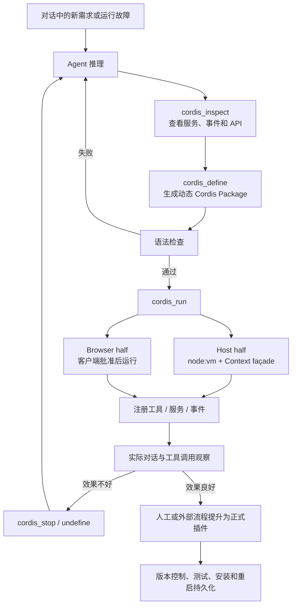
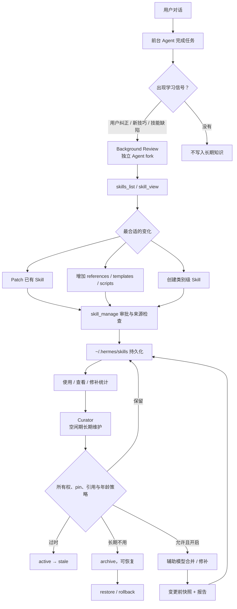
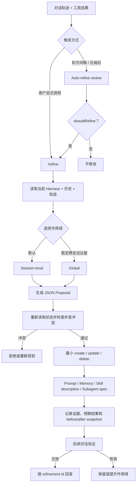
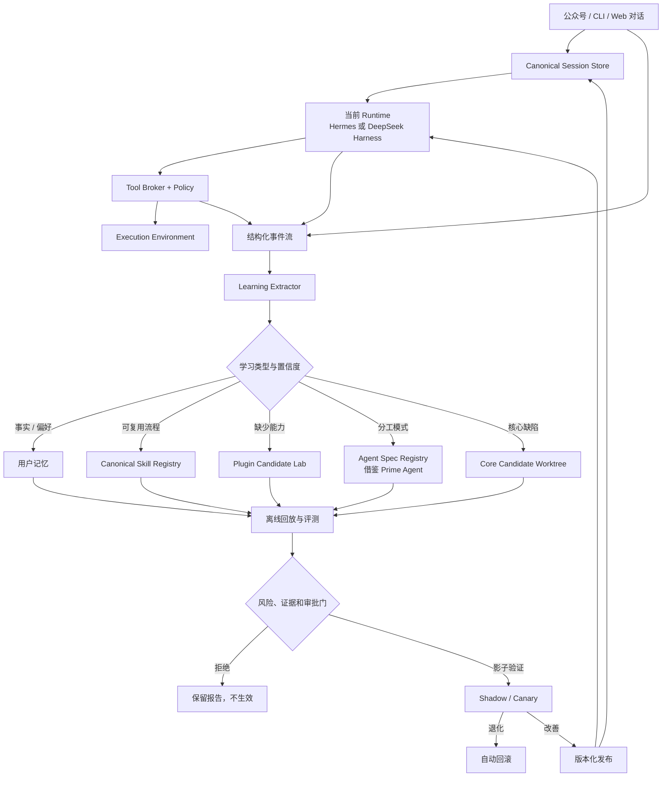

# 可控的持续学习与自进化设计

## 1. DeepSeek Harness 的自进化逻辑在哪里

DeepSeek Harness 的进化对象是**运行时能力结构**。Agent 通过自引用 Cordis 工具查看当前服务和事件，生成动态插件，在当前进程中加载、观察、停止和替换它。



真正体现自进化的源码区域是：Cordis 插件体系、`tool-cordis` 自引用工具、host/client runner，以及动态包生命周期。它改变的是“Agent 现在拥有哪些工具、服务、事件监听和 UI 能力”。

但这个闭环在“持久化提升”处没有完全自动化：动态包默认驻留内存，进程重启后消失；`node:vm` 不是安全边界。因此它适合做**能力候选实验室**，不能直接承担生产自修改。

## 2. Hermes Agent 的自进化逻辑在哪里

Hermes 的主要进化对象是**程序性知识和行为策略**。它不会默认让后台 Agent 改写核心，而是把对话中的成功步骤、用户纠正、偏好和故障经验写入 Skills，再由 Curator 长期维护。



真正体现自进化的源码区域包括：

- `agent/background_review.py`：从会话中识别学习信号；
- `tools/skill_manager_tool.py`：创建、patch、编辑和归档 Skill；
- `tools/skill_usage.py`：使用与来源统计；
- `agent/curator.py`：空闲期状态迁移和可选的模型整理；
- `agent/curator_backup.py`：快照和回滚；
- `hermes_cli/plugins.py`：插件扩展机制，但不是默认自治修改对象。

Hermes 的优势是长期行为改进已经具备治理闭环；局限是它主要让 Agent “更会做”，并不会自动让底层控制层“拥有全新基础能力”。

## 3. Prime Agent 的自进化逻辑在哪里

Prime Agent 的进化对象是**补充 Harness 状态和程序化工作方式**。它通过 `/refine` 或 auto-refine 对当前轨迹做证据驱动的小步修改，同时保持基础系统 Prompt 不变。



与另外两套相比，Prime Agent 提供了两个特别有价值的设计：第一，local/global scope 让临时任务知识不会轻易污染所有会话；第二，planning 与 apply 分离，并在应用前检测状态变化。它还利用持久 IPython、Kernel snapshot 和 retained subagent 保留长任务的程序状态。

其限制同样明确：IPython 运行模型生成代码并继承 worker 的操作系统权限，不是沙箱；Continual Harness 的 skill entry 是调用描述，不会自动把新代码安全地打包成正式 Skill。

## 4. 在 self_modifying_bot 中组合三种进化

本项目不应二选一，而应把 Hermes 当作**知识进化器**，把 DeepSeek Harness 当作**能力实验器**，再由 Bot 控制层负责跨 Runtime 的记忆、评测和发布。



### 4.1 不能只依赖 Harness 自己的记忆

为了切换 Runtime 仍不丢学习结果，Bot 必须拥有规范状态：

- 原始对话日志：追加写，不改写历史；
- 有界会话摘要：带生成版本和来源消息范围；
- 用户记忆：偏好、长期事实、有效期、置信度和撤销记录；
- Skill Registry：统一 Skill ID、版本、适用范围、来源和评测分数；
- Runtime 映射：Hermes Skill、Cordis 插件与统一能力之间的映射；
- 反馈与评测：某条经验是否真的改善后续任务。

Hermes 可以读取和维护映射后的 Skills；DeepSeek Harness 可以把已批准的 Skills 注入上下文，并加载由 Skill 触发的正式 Cordis 插件；Prime Agent 可以消费 session-local Harness 投影并提交晋级提案。三者都不能成为唯一事实来源。

## 5. 如何做到“越对话越聪明”

每次对话结束后运行 Learning Extractor，但不是把所有内容都写进长期记忆。只捕获四类信号：

1. **用户明确纠正**：如输出格式、工作顺序、禁忌和偏好。
2. **可验证的成功经验**：解决了非平凡问题，并有测试、返回值或用户确认。
3. **重复模式**：同类需求或故障至少多次出现，值得形成 Skill。
4. **能力缺口**：现有工具无法完成任务，需要新插件或 Adapter。

学习对象分开存放：

| 学到的内容 | 保存位置 | 生效方式 |
|---|---|---|
| 用户偏好和稳定事实 | User Memory | 检索后注入当前用户会话 |
| 可复用步骤和陷阱 | Skill Registry | 按触发条件加载，不全量塞入 Prompt |
| 新工具或集成 | Plugin Candidate | 评测和审批后安装 |
| Runtime 差异 | Adapter Knowledge | 更新能力映射和兼容测试 |
| 有效的分工方式 | Agent Spec Registry | 按任务调用已验证的子 Agent 角色 |
| 核心控制逻辑 | Core Candidate | 独立发布流程 |

“聪明”必须由效果衡量，而不是由记忆数量衡量。至少记录：任务成功率、用户纠正率、工具失败率、平均轮数、成本、延迟和安全拒绝情况。只有在回放集或影子流量上改善且没有越权，候选经验才晋级。

## 6. 如何保证可控

### 6.1 所有长期项目都带治理元数据

```text
id / version / owner / scope
source_session_ids / evidence
created_by / approved_by
confidence / expires_at
risk_level / required_capabilities
eval_results / status
supersedes / rollback_target
```

不能只存一段自由文本。用户记忆必须区分“用户明确说过”“模型推断”“工具验证”；模型推断默认低置信度并可过期。

### 6.2 分级自动化

| 变化 | 是否可自动生效 |
|---|---|
| 会话摘要 | 可以，保留原始日志和重建能力 |
| 低风险表达偏好 | 可以，用户可查看、删除和关闭 |
| 新增/修改 Skill | 先影子评测；高置信低风险可自动，小概率抽查 |
| 安装或修改插件 | 不可以直接生效，需要测试和批准 |
| 扩大文件、网络、shell 权限 | 必须人工批准，且按身份和环境限定 |
| 核心代码或发布配置 | 必须人工批准和可回滚发布 |

### 6.3 防止错误越学越深

- 不从单次失败或模型自己的陈述直接形成高置信知识；
- 负反馈立即降低关联记忆/Skill 权重，连续退化自动停用；
- 相互冲突的记忆并存并标注上下文，不静默覆盖；
- Skill 按需检索并限制注入预算，避免 Prompt 被旧经验污染；
- 使用时间衰减、有效期和 active/stale/archive 生命周期；
- 每次写入和发布都有审计事件，用户可执行 inspect、diff、pin、disable、restore、rollback；
- 公网 Channel 永远不能批准插件、shell 权限或核心发布。

## 7. 释放三套 Harness 效果的接入方式

### 7.1 Hermes Runtime

- 让 Hermes 使用 Bot 提供的会话快照和 Skill Registry 投影；
- 保留 Background Review 和 Curator，但把自治范围限制为 Bot 标记为 `curator_managed` 的 Skills；
- 把 Hermes 的 usage、patch、archive 和 report 事件回传到 Bot；
- 用户拥有、固定或外部安装的 Skills 不允许后台改动；
- Curator 修改先在候选 Skill 版本中执行，通过跨 Runtime 回放评测后再提升。

这样既保留 Hermes 的长期整理能力，又避免它维护一套与 Bot 分叉的隐形知识库。

### 7.2 DeepSeek Harness Runtime

- 开放 `cordis_inspect`，使 Agent 能理解当前公开扩展点；
- `cordis_define/run` 只指向隔离 Candidate Environment，默认不接生产密钥和共享宿主 shell；
- 收集动态包源码、依赖、工具 schema、运行日志和评测结果；
- 成功候选自动生成正式插件骨架，但安装和发布仍经过策略门；
- 正式插件使用版本、签名、能力清单、健康检查和回滚；
- 多用户场景中动态包使用独立进程或容器，避免共享进程串扰。

这会释放 DeepSeek Harness 的即时能力创造优势，同时补上持久化和安全发布缺口。

### 7.3 Prime Agent Runtime

- 将 Bot 的 session candidate 投影为 Prime 的 session-local Harness 状态；
- 保留 `/refine` 和 auto-refine，但默认禁止直接写 global，改为向 Bot 提交 global-promotion proposal；
- 将 prompt、memory、skill、subagent 四类条目映射到 Bot 的统一 Registry，并保留来源和 refinement id；
- 接收 Prime 的 before/after snapshot、冲突检测和 rollback 事件；
- 允许持久 IPython 用于授权的长任务，但必须绑定具体 Execution Environment，不能继承 Bot 控制面的生产权限；
- 将验证有效的 Subagent Spec 提升为跨 Runtime Agent Spec，让 Hermes 或 DeepSeek Runtime 也能复用相同分工策略；
- Python-backed Skill 仍通过插件/包候选发布流程，不允许 `/refine` 绕过依赖审查。

这样可以释放 Prime Agent 在长任务状态、程序化组合和小步精炼方面的优势，同时由 Bot 统一决定哪些局部经验可以跨会话、跨项目或跨 Runtime 生效。

## 8. 建议的实施顺序

1. Canonical Session Store 和用户记忆，先实现跨 Runtime 不丢上下文。
2. Learning Extractor、Skill Registry、来源/版本/撤销和按需检索。
3. Hermes Skill 投影、事件回传和 Curator 候选模式。
4. Prime 的 local/global candidate、proposal/apply 冲突检测和 Agent Spec Registry。
5. 统一评测集、对话回放、指标和影子模式。
6. DeepSeek Cordis Candidate Environment 与正式插件提升流水线。
7. 最后开放核心代码候选进化，并始终保留人工审批和回滚。

最重要的原则是：**允许系统自动学习低风险知识，但不允许它自动扩大自己的权限。** 能力可以提出、构建和评测；权限和生产发布必须来自控制层策略与可信主体。
