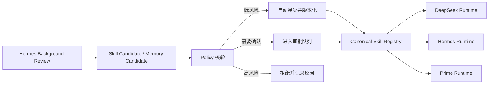

# Hermes Skill 优化流程与接入方案

## 1. 结论

Hermes 的 Skill 优化不是修改模型权重，而是通过“对话复盘、Skill 文件增量维护、使用情况统计和周期性整理”实现持续改进。

它包含两个相互配合的流程：

1. **Background Review**：从真实对话中发现可复用经验，并创建或修改 Skill。
2. **Curator**：维护 Skill 的使用状态、过期状态、归档状态以及可选的合并整理。

```mermaid
flowchart TD
    A[一轮对话完成] --> B{达到 Skill review 间隔?}
    B -- 否 --> C[继续对话]
    B -- 是 --> D[后台启动 Background Review]
    E[/refine] --> D
    D --> F[分析纠正、重复问题和新技巧]
    F --> G{找到合适的已有 Skill?}
    G -- 当前 Skill 可覆盖 --> H[更新当前 Skill]
    G -- 存在同类 Skill --> I[更新类别级 Skill]
    G -- 只有补充资料 --> J[写入 references/templates/scripts]
    G -- 没有合适 Skill --> K[创建类别级 Skill]
    H --> L[记录来源与使用情况]
    I --> L
    J --> L
    K --> L
    L --> M[Curator 周期维护]
    M --> N[标记 stale、归档、恢复或可选合并]
```

## 2. 触发方式

### 2.1 自动触发

自动复盘发生在主回复已经返回用户之后，因此不会让当前请求等待 Skill 优化。触发条件主要包括：

- 达到 `skill_nudge_interval` 指定的工具迭代次数；
- 当前 Runtime 具备 `skill_manage` 能力；
- 当前对话没有被中断；
- 后台复盘没有被显式跳过。

这意味着 Hermes 不会每轮对话都修改 Skill。达到间隔后才会检查，且没有有效经验时可以不保存任何内容。

### 2.2 手动触发

用户可以使用：

```text
/refine
```

该命令会立即对当前会话进行 Memory 和 Skill 复盘，适合用户刚刚完成一轮重要工作、发现流程改进点，或者希望主动固化经验时使用。

## 3. Hermes 识别的优化信号

Background Review 重点查找以下信号：

- 用户纠正了表达风格、格式、详细程度或输出结构；
- 用户说“以后都这样”“记住这个”等长期偏好；
- 用户纠正了执行顺序、工作流或验收步骤；
- 出现可复用的调试方法、命令、工具调用技巧或解决方案；
- 当前 Skill 不完整、过时，或无法覆盖实际任务；
- 同类任务中反复出现同一个解决方案。

以下内容通常不应该进入 Skill：

- 一次性任务细节；
- 缺少依赖、命令不存在、凭据未配置等环境缺失；
- 已经通过重试解决的瞬时错误；
- 未验证的“某工具不可用”结论；
- 只对当前机器路径有效的临时状态；
- 没有可靠替代方案的未解决失败。

## 4. Skill 更新优先级

Hermes 的更新顺序是：

1. 如果当前已加载 Skill 可以承载这条经验，优先更新它；
2. 否则寻找已有的类别级 Skill 并更新；
3. 如果只是详细资料，写入 `references/`、`templates/` 或 `scripts/`；
4. 只有没有合适类别时才创建新的类别级 Skill。

Skill 应该描述一类可复用任务，而不是一个单独的错误或一次性项目。例如：

```text
推荐：wechat-bot-integration
推荐：observability-for-agent-systems
推荐：harness-runtime-management

不推荐：fix-http-200-error
不推荐：repair-bot-today
不推荐：deepseek-bug-2026
```

典型结构：

```text
skill-name/
├── SKILL.md
├── references/
│   ├── api-notes.md
│   ├── troubleshooting.md
│   └── error-cases.md
├── templates/
└── scripts/
```

其中：

- `SKILL.md` 保存触发条件、执行流程、约束和验收标准；
- `references/` 保存 API 差异、错误记录、复现步骤和调研资料；
- `templates/` 保存模板和脚手架；
- `scripts/` 保存可重复执行的验证脚本和探针。

## 5. Memory 与 Skill 的边界

Hermes 将二者明确区分：

| 类型 | 应保存的内容 |
| --- | --- |
| Memory | 用户是谁、用户偏好、当前项目状态和上下文 |
| Skill | 以后处理这类任务应该采用什么方法 |

例如：

```text
“用户偏好使用中文回复” -> Memory
“公众号异步任务必须先确认通知邮箱，再创建任务” -> Skill
```

## 6. Skill 所有权与安全边界

后台 Review 不能随意修改所有 Skill。默认受保护的内容包括：

- Hermes 内置 Skill；
- 通过 `hermes skills install` 安装的 Skill；
- 外部 Skill 目录中的 Skill；
- 被 pin 的 Skill；
- 用户手工创建但尚未交给 Curator 管理的 Skill。

后台 Review 创建的 Skill 可以自动进入 Curator 管理。用户手工创建的 Skill 如需交给 Curator 管理，应显式执行：

```powershell
hermes curator adopt <skill-name>
```

这个边界可以防止自动复盘覆盖用户明确维护的规则。

## 7. Curator 的职责

Background Review 负责“发现和写入经验”，Curator 负责“长期维护 Skill 库”。常用命令包括：

```powershell
hermes curator status
hermes curator run --dry-run
hermes curator run --consolidate
hermes curator pin <skill-name>
hermes curator adopt <skill-name>
```

Curator 会统计 Skill 的加载、查看、修改和使用情况，并根据长期未使用情况：

- 标记为 `stale`；
- 归档长期未使用的 Skill；
- Skill 再次使用后重新激活；
- 跳过被 pin 的 Skill；
- 在开启 consolidation 时合并重复或相似的类别级 Skill。

默认策略更偏向确定性的生命周期维护。LLM 合并属于可选能力，不应在没有备份、报告和回滚机制时自动开启。

## 8. 接入 self_modifying_bot 的推荐方式

在 `self_modifying_bot` 中，不应让 Hermes 直接修改跨 Runtime 的全局知识库。建议将 Hermes 的结果转换为统一的候选事件：



推荐的统一事件至少包含：

```json
{
  "kind": "skill_candidate",
  "source_runtime": "hermes",
  "scope": "user",
  "project": "self_modifying_bot",
  "target": "wechat-bot-integration",
  "operation": "patch",
  "reason": "用户确认了异步任务通知流程",
  "evidence": ["trace-id"],
  "risk": "low",
  "rollback": "skill-revision-previous"
}
```

这样可以同时保留 Hermes 的优点和主系统的可控性：

- Hermes 负责从真实对话中提出高质量经验；
- Policy 负责判断是否允许写入；
- Registry 负责版本、作用域和跨 Runtime 分发；
- Dashboard 负责展示变更来源、证据、审批和回滚；
- 失败时可以恢复上一版 Skill，而不是直接丢失历史。

## 9. 与当前项目的落地原则

1. Skill 优化必须异步执行，不能阻塞微信公众号 webhook。
2. 每次自动修改必须产生 revision、trace、来源 Runtime 和证据引用。
3. 低风险内容可以自动合并，高风险内容需要用户确认。
4. Skill、Memory、Plugin Candidate 分开存储，不能混为一个文件。
5. 跨项目经验进入用户级 Registry，项目规则进入项目级 Registry。
6. 跨 Runtime 分发前需要经过统一 Schema 校验。
7. 所有自动修改都必须支持 diff、审计和回滚。
8. `/refine` 应作为用户主动触发 Hermes 风格复盘的统一入口。

## 10. Hermes 源码参考

本结论基于以下 Hermes 源码实现整理：

- `agent/turn_finalizer.py`：自动复盘触发和后台任务调度；
- `agent/codex_runtime.py`：App Server 路径下的复盘触发；
- `agent/background_review.py`：Memory/Skill 复盘提示词和写入策略；
- `agent/curator.py`：Skill 生命周期和整理逻辑；
- `tools/skill_manager_tool.py`：Skill 创建、修改和文件写入工具；
- `tools/skill_usage.py`：Skill 使用情况和来源记录；
- `hermes_cli/curator.py`：Curator 状态与命令行管理；
- `hermes_cli/cli_commands_mixin.py`：`/refine` 命令入口。

