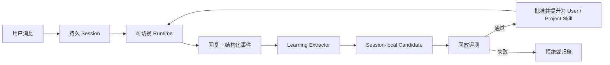

# Self Modifying Bot 落地实施方案

## 1. 当前实现审计

截至当前源码，项目属于可运行原型，不是完整的自进化系统。

### 已实现

| 能力 | 当前实现 | 状态 |
|---|---|---|
| 微信公众号接入 | `/wechat` 验签、接收文本、返回 XML 文本 | 原型可用 |
| 健康检查 | `/health` 返回 Runtime 与模型 | 可用 |
| 用户目录配置 | `~/.self_modifying_bot/config.toml` 和 `.env` | 基础可用 |
| Runtime 选择 | DeepSeek Harness、Hermes、Echo 的静态工厂 | 适配雏形 |
| 简单记忆 | 按用户保存有限条数的 JSONL 输入输出 | 演示级 |
| 基础测试 | 微信签名和简单记忆边界 | 覆盖很少 |

### 尚未实现

- Prime Agent Runtime Adapter；
- 不重启切换 Runtime 的 CLI 和 Runtime Manager；
- 规范 Session Store、摘要、任务、产物和 Runtime checkpoint；
- 结构化用户记忆及其来源、置信度、有效期和撤销；
- Learning Extractor 和“是否值得学习”的判断；
- Canonical Skill Registry 与 Agent Spec Registry；
- Hermes Curator、Prime Refine、DeepSeek Cordis 的双向同步；
- Tool Broker、Policy Engine 和 Execution Environment；
- 候选评测、影子运行、审批、发布与回滚；
- 多进程安全、数据库事务、锁、并发控制和完整审计；
- 微信消息异步任务、超时处理、幂等去重和主动回复。

因此当前 `EvolutionMemory` 只是有限对话回放，不能称为真正“自进化”。它还会重写整个 JSONL 文件，不适合作为生产会话库。

## 2. 第一版目标边界

第一版应证明以下闭环，而不是立即允许 Agent 修改核心代码：



V1 只自动学习低风险偏好和 Skill 候选。插件、shell 权限和核心代码都只能生成提案，不能自动发布。

## 3. 推荐技术结构

继续使用 Python/FastAPI，但拆分为清晰模块。数据层先使用 SQLite，后续多实例部署时可替换 PostgreSQL。

```text
self_modifying_bot/
├── selfbot/
│   ├── api/                 # FastAPI 与管理 API
│   ├── channels/            # WeChat、CLI、未来其他渠道
│   ├── sessions/            # 规范消息、摘要、任务与 checkpoint
│   ├── runtimes/            # Runtime 协议及三个 Adapter
│   │   ├── deepseek.py
│   │   ├── hermes.py
│   │   └── prime.py
│   ├── learning/            # 信号提取、候选、冲突和晋级
│   ├── registry/            # Memory、Skill、Agent Spec、Plugin
│   ├── tools/               # Broker、能力协议和审计
│   ├── policy/              # 身份、审批、风险和配额
│   ├── environments/        # NoExec、Local、Docker/WSL、Remote
│   ├── evaluation/          # 回放集、指标、Shadow、Canary
│   ├── releases/            # 候选、版本、发布和回滚
│   └── cli/                 # selfbot 命令
├── migrations/
├── tests/
└── docs/
```

运行状态继续放在：

```text
~/.self_modifying_bot/
├── config.toml
├── secrets.env
├── state.db
├── artifacts/
├── runtimes/
├── environments/
├── candidates/
├── releases/
└── logs/
```

## 4. 核心接口

### 4.1 Runtime Adapter

```python
class RuntimeAdapter(Protocol):
    metadata: RuntimeMetadata

    async def discover(self) -> DiscoveryResult: ...
    async def health_check(self) -> HealthReport: ...
    async def start(self, snapshot: SessionSnapshot, tools: ToolEndpoint) -> RuntimeHandle: ...
    async def send_turn(self, handle: RuntimeHandle, turn: UserTurn) -> AsyncIterator[RuntimeEvent]: ...
    async def checkpoint(self, handle: RuntimeHandle) -> RuntimeCheckpoint: ...
    async def stop(self, handle: RuntimeHandle) -> None: ...
```

`RuntimeEvent` 至少包括文本增量、最终回复、工具请求、工具结果、用量、学习提案和错误。不能只返回一个字符串，否则控制层无法统一评测和审计。

### 4.2 Learning Proposal

```python
class LearningProposal:
    id: str
    kind: Literal["memory", "skill", "agent_spec", "plugin", "core"]
    scope: Literal["session", "user", "project", "global"]
    operation: Literal["create", "update", "archive"]
    target_id: str | None
    content: dict
    evidence_message_ids: list[str]
    confidence: float
    risk: Literal["low", "medium", "high", "critical"]
    expected_outcome: str
    base_version: int | None
```

Extractor 只能提交 Proposal。Apply Service 重新读取目标版本、检查冲突、权限和评测结果后才应用。这沿用 Prime Agent 的 plan/apply 分离。

### 4.3 Tool Broker

```python
class ToolRequest:
    subject_id: str
    session_id: str
    runtime_id: str
    environment_id: str
    capability: str
    arguments: dict
    idempotency_key: str
```

执行路径固定为：Runtime → Broker → Policy → Environment。Harness 原生工具如果不能被禁用，整个 Harness 必须在受控环境内运行。

## 5. 数据模型

SQLite 初始表建议如下：

| 表 | 作用 |
|---|---|
| `subjects` | 渠道身份与内部用户映射 |
| `sessions` | 会话、当前 Runtime、Environment、状态 |
| `messages` | 追加写的规范消息与 Runtime 事件 |
| `session_summaries` | 有界摘要、来源消息范围和生成版本 |
| `runtime_checkpoints` | Runtime 私有 checkpoint 引用 |
| `memories` | 用户事实/偏好、来源、置信度、有效期、状态 |
| `skills`、`skill_versions` | 统一 Skill 与不可变版本 |
| `agent_specs`、`agent_spec_versions` | 子 Agent 角色和调用契约 |
| `learning_proposals` | 候选内容、作用域、证据、风险和状态 |
| `evaluations` | 数据集、指标、基线、候选结果 |
| `approvals` | 谁在何时批准了什么权限或发布 |
| `tool_calls` | 工具请求、策略决定、结果和耗时 |
| `releases` | 插件/核心版本、健康状态和回滚目标 |
| `audit_events` | 所有重要状态迁移的追加日志 |

每个可演化对象使用不可变 version；更新是创建新版本并移动 active 指针，不覆盖旧内容。

## 6. 三套 Runtime 的落地方式

### 6.1 DeepSeek Harness Adapter

- 第一阶段只使用正式公开 API 完成普通回复和事件转换；
- 第二阶段开放 `cordis_inspect` 给候选实验环境；
- `cordis_define/run` 只能在独立进程或容器中运行；
- 把动态包源码、API 依赖、schema 和日志保存为 `plugin` Proposal；
- 通过评测后生成正式插件目录和 manifest，人工批准安装；
- 正式插件版本失败时回到上一版本。

### 6.2 Hermes Adapter

- 将 Canonical Skill Registry 投影到一个 Bot 管理的 Hermes Skill 目录；
- 只把 `curator_managed=true` 的 Skill 交给后台 Review/Curator；
- 捕获 Skill create/patch/archive、usage 和 Curator report；
- Hermes 的修改先成为 `skill` Proposal，不直接覆盖 Registry active version；
- Bot 评测通过后发布新版本，再刷新 Hermes 投影；
- 用户拥有、external、hub、pinned Skill 永远不接受后台覆盖。

### 6.3 Prime Agent Adapter

- 把当前 Session Candidate 投影为 Prime session-local Harness；
- `/refine` 保留，但 global 写入改成向 Bot 提交 promotion Proposal；
- 映射 Prime 的 prompt、memory、skill、subagent 到统一 Registry；
- 保存 refinement id、before/after snapshot 和 rollback 关系；
- 持久 IPython 绑定具体 Execution Environment，不能继承 Bot 控制层权限；
- Subagent spec 评测通过后进入 Agent Spec Registry，供其他 Runtime 复用；
- Python-backed Skill 仍需走插件包审查，不能由 `/refine` 直接安装到生产环境。

## 7. “越聊越聪明”的实际算法

### 7.1 每轮结束

1. 追加保存用户消息、回复、工具结果和反馈。
2. 更新有界摘要，但不改写原始消息。
3. 运行廉价规则检测明确纠正、成功验证、重复模式和能力缺口。
4. 只有命中信号时才调用 Learning Extractor 模型。
5. Extractor 返回零个或多个结构化 Proposal；没有证据时必须允许零修改。
6. 默认保存为 session scope，并记录基线版本。

### 7.2 晋级条件

| 从 | 到 | 最低条件 |
|---|---|---|
| Session | User | 用户明确偏好，或至少两次一致证据且无冲突 |
| Session | Project | 在项目回放集上改善且不包含用户私密偏好 |
| User/Project | Global | 多主体、多任务验证；人工批准 |
| Skill Proposal | Active Skill | 回放指标改善、风险检查通过 |
| Plugin Proposal | Release | 隔离测试、能力清单、人工批准、Canary 健康 |
| Core Proposal | Release | 完整测试、安全审查、人工批准和回滚演练 |

不能用“模型认为有用”代替验证。负反馈、工具错误或成功率下降会降低候选分数，达到阈值自动 disable 并回滚。

### 7.3 检索注入

每轮只检索与当前主体、项目和任务相关的少量 Memory、Skill 和 Agent Spec；根据 scope、触发条件、相似度、最近验证时间和历史成功率排序。设置严格字符/token 上限，避免长期知识无限进入 Prompt。

## 8. CLI 与管理面

最小 CLI：

```text
selfbot serve
selfbot status
selfbot runtime list|discover|install|use|health|rollback
selfbot session list|show|export
selfbot memory list|forget|pin|disable
selfbot skill list|show|diff|approve|reject|pin|rollback
selfbot proposal list|show|approve|reject
selfbot eval run|compare
selfbot environment list|create|bind|test
selfbot release list|promote|rollback
selfbot audit show
```

Runtime **不会在每轮对话后自动切换**。切换由用户通过 `/harness` 命令或管理员 CLI 主动发起；系统只把 turn boundary 作为安全的执行时点：若当前回复或工具调用仍在进行，先记录待切换目标，等本轮正常结束后再生成 checkpoint、启动新 Runtime，并用规范摘要、近期消息、任务和产物重建上下文。新 Runtime 健康检查或恢复失败时，不更新 `sessions.runtime_id`，继续使用旧 Runtime。

对话内命令建议如下：

```text
/harness                         # 显示当前 Harness 和可切换列表
/harness list                    # 显示安装状态、健康状态和能力
/harness use hermes-agent        # 本轮结束后切换当前会话
/harness use deepseek-harness
/harness use prime-agent
/harness status                  # 显示当前或待切换状态
/harness cancel                  # 取消尚未执行的切换
```

`/harness use` 默认只影响当前 Session，不修改其他用户或全局默认值。管理员若要改变新会话默认值，使用：

```text
selfbot runtime default set deepseek-harness
```

切换命令本身是控制命令，不发送给旧 Harness 推理，也不计入普通用户对话内容。公众号渠道应先校验用户是否有切换权限；未授权用户只能查看当前 Harness，不能触发安装或切换。

## 9. 分阶段实施

### Phase 0：整理现有原型

目标：建立可持续开发基线。

- 创建 Python package 和模块目录；
- 引入 SQLite migration、repository 和事务；
- 保留现有 `/wechat` 行为；
- 增加配置校验、结构化日志、错误边界和测试夹具；
- 将现有 JSONL 导入脚本作为一次性迁移工具。

验收：现有微信公众号测试不退化；重启后会话数据仍在；并发写不丢数据。

### Phase 1：Canonical Session 与 Runtime Manager

目标：跨 Runtime 保留可迁移上下文。

- 实现规范消息、摘要、任务和 checkpoint；
- 定义 Runtime Adapter/Event 协议；
- 重写 DeepSeek/Hermes Adapter，增加 Prime Adapter；
- 实现 Runtime discover、health，以及用户通过 `/harness use` 主动发起的 turn-boundary 切换；
- Runtime 缺失时明确降级，不伪装为目标 Runtime。

验收：未收到 `/harness use` 时，无论经过多少轮对话都不自动切换；同一测试会话主动在三个 Runtime 间切换后，近期上下文和未完成任务仍可恢复；切换失败自动保留旧 Runtime。

### Phase 2：可控记忆与 Skill Registry

目标：实现第一条真正的学习闭环。

- 实现结构化 Memory、Skill version、Proposal 和 Audit；
- 实现规则信号和 Learning Extractor；
- 实现 session → user/project 的晋级与撤销；
- 实现按需检索和注入预算；
- 提供 inspect/diff/pin/forget/rollback CLI。

验收：用户连续纠正一种格式后，后续新 Session 能稳定遵守；删除该记忆后不再应用；冲突偏好不会静默覆盖。

### Phase 3：Harness 原生进化桥接

目标：释放三套 Harness 的原生优势。

- Hermes Skill 投影和 Curator Proposal；
- Prime local Harness 投影、refinement Proposal 和 Agent Spec；
- DeepSeek Cordis inspect 与隔离动态插件候选；
- 建立双向映射和事件去重，避免循环同步。

验收：三个 Runtime 各自产生的候选都进入统一 Proposal 队列；未批准候选不会影响其他用户或 Runtime。

### Phase 4：Tool Broker 与执行环境

目标：让工具能力可移植且权限可证明。

- 实现规范 capability、Policy 决策和 Tool Audit；
- 先实现 `NoExec`、`LocalRestricted`，再实现 Docker/WSL；
- 主体、Session、Runtime 和 Environment 四者绑定；
- 建立 Adapter capability conformance tests；
- 微信普通用户固定为 `NoExec`。

验收：未经授权的 shell、越界文件和网络请求均被拒绝并记录；更换 Runtime 不改变策略结果。

### Phase 5：评测、发布与回滚

目标：让“变聪明”有客观证据。

- 从已授权会话构建脱敏回放集；
- 定义成功率、纠正率、工具错误、成本、延迟和安全指标；
- Skill/Agent Spec 支持 Shadow；插件支持隔离测试和 Canary；
- 实现不可变 Release、active 指针和自动回滚；
- 核心代码只生成候选工作树与报告，保持人工发布。

验收：一个故意退化候选不能晋级；Canary 健康失败自动恢复旧版本；回滚不丢会话和用户配置。

## 10. 测试策略

- 单元测试：解析、作用域、冲突、版本、策略和检索排序；
- Contract 测试：三个 Runtime Adapter 接受同一事件用例；
- 集成测试：FastAPI → Session → Runtime → Broker → Store；
- 回放测试：固定对话集比较 baseline 与 candidate；
- 安全测试：提示注入、跨用户数据、路径逃逸、shell、SSRF、重复消息；
- 故障测试：Runtime 崩溃、数据库锁、网络超时、切换中断和回滚失败；
- 微信测试：签名、重复 MsgId、非文本、响应时限和异步回复。

生产前最低要求是跨用户隔离、幂等处理、敏感信息脱敏、备份恢复和 Tool Broker 安全测试通过。

## 11. 推荐的第一个开发里程碑

先实现 Phase 0 和 Phase 1，不直接开始动态插件。首个里程碑应交付：

1. SQLite Canonical Session Store；
2. 三个统一 Runtime Adapter；
3. `selfbot runtime list/status/use`；
4. 用户通过 `/harness use` 主动触发的 Turn-boundary Runtime 切换与失败回退；
5. 微信消息幂等和错误处理；
6. 对应单元与集成测试。

完成这个里程碑后，系统才有稳定的“身体”和连续上下文；随后实现的学习、Skill 和插件进化才不会绑定某个 Harness 或丢失状态。
