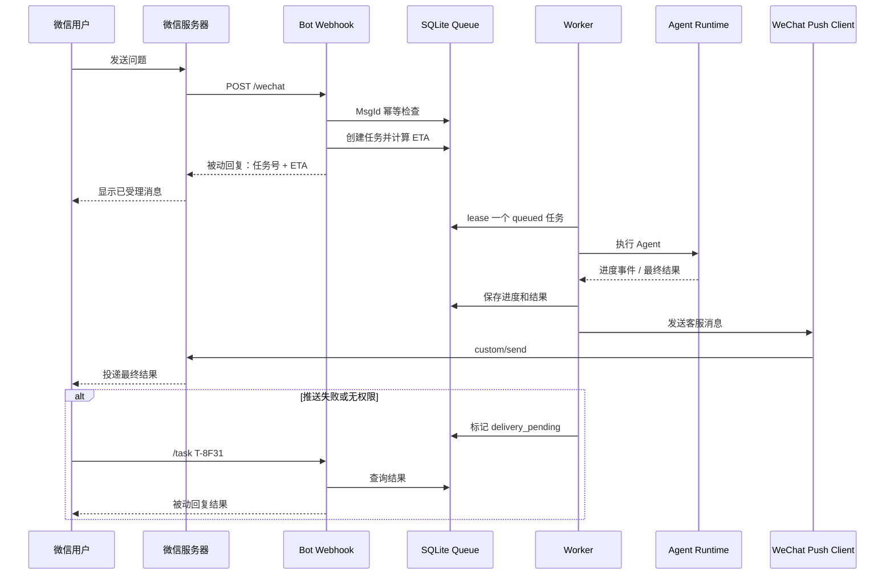

# 微信异步任务、预计时间与消息推送

## 1. 目标交互

微信公众号回调必须快速返回，不能一直等待 Agent。用户收到的第一条消息应包含任务编号、预计时长和查询方式，例如：

```text
已开始处理（任务 T-8F31）。
预计 1～2 分钟完成，前面还有 1 个任务。
完成后我会在这里发送结果；也可以发送 /task T-8F31 查看进度。
```

若预计超过 10 分钟：

```text
这是一个较长任务（任务 T-8F31），预计 12～18 分钟。
我会先在约 5 分钟后发送一次进度，完成后再发送结果。
```

预计时间必须是区间而不是虚假精确值。用户离开聊天页面不影响微信服务器投递消息；能否主动推送取决于公众号客服消息接口权限、用户交互时间窗口和微信侧限制。

## 2. 整体流程



## 3. ETA 怎么计算

### 3.1 组成

```text
预计完成时间 = 预计排队时间 + 预计执行时间 + 推送缓冲
```

- 排队时间：前面任务的剩余时长除以可用 Worker 数；
- 执行时间：相同 Runtime、模型和任务类型的历史耗时分布；
- 推送缓冲：通常取数秒，用于持久化和调用微信 API。

### 3.2 冷启动默认值

没有历史数据时使用保守档位：

| 任务类型 | 判定示例 | 初始区间 |
|---|---|---|
| 简单对话 | 不调用工具 | 10～30 秒 |
| 普通 Agent | 少量检索或工具 | 1～3 分钟 |
| 代码/文件任务 | 多步工具调用 | 3～10 分钟 |
| 子 Agent/评测 | 并行或长任务 | 10～30 分钟 |

任务类型只能用于初始估算。Worker 运行后根据实际事件更新 ETA。

### 3.3 历史校准

按 `(runtime, model, task_class)` 保存最近成功任务耗时，至少累计 20 个样本后使用：

- 中位数 P50 作为较乐观值；
- P80 或 P90 作为区间上界；
- 最近任务使用更高权重；
- 超时和失败任务单独统计，不能从样本中静默删除。

对用户显示向上取整的自然区间，例如 `45～80 秒` 显示为 `约 1～2 分钟`。ETA 明显变化时再通知，避免每几秒刷屏。

### 3.4 进度通知规则

- 预计少于 3 分钟：只发受理和最终结果；
- 3～10 分钟：超过原 ETA 上界时发一次延期说明；
- 超过 10 分钟：每 5～10 分钟最多一次有实质内容的进度；
- 不发送“还在处理”这种无信息更新，应说明当前阶段和新 ETA；
- 用户可用 `/task <id>` 主动查询，查询不影响 Worker。

## 4. 单机后台队列实现

当前部署在一台 Windows 电脑上，V1 使用 SQLite 持久队列和独立 Worker 进程。不要使用 FastAPI `BackgroundTasks` 或仅在内存中 `asyncio.create_task()` 承担长任务，因为服务重启后任务会丢失。

### 4.1 数据表

```sql
CREATE TABLE jobs (
    id TEXT PRIMARY KEY,
    channel TEXT NOT NULL,
    channel_user_id TEXT NOT NULL,
    session_id TEXT NOT NULL,
    source_message_id TEXT NOT NULL UNIQUE,
    runtime_id TEXT NOT NULL,
    task_class TEXT NOT NULL,
    request_json TEXT NOT NULL,
    status TEXT NOT NULL,
    priority INTEGER NOT NULL DEFAULT 0,
    queued_at TEXT NOT NULL,
    available_at TEXT NOT NULL,
    started_at TEXT,
    heartbeat_at TEXT,
    lease_owner TEXT,
    lease_until TEXT,
    attempt INTEGER NOT NULL DEFAULT 0,
    max_attempts INTEGER NOT NULL DEFAULT 3,
    eta_low_seconds INTEGER,
    eta_high_seconds INTEGER,
    progress_json TEXT,
    result_json TEXT,
    error_json TEXT,
    completed_at TEXT
);

CREATE TABLE deliveries (
    id TEXT PRIMARY KEY,
    job_id TEXT NOT NULL,
    channel TEXT NOT NULL,
    kind TEXT NOT NULL,
    payload_json TEXT NOT NULL,
    status TEXT NOT NULL,
    attempt INTEGER NOT NULL DEFAULT 0,
    available_at TEXT NOT NULL,
    sent_at TEXT,
    provider_response_json TEXT,
    FOREIGN KEY(job_id) REFERENCES jobs(id)
);
```

状态机：

```text
queued → leased → running → succeeded → delivery_pending → delivered
                   └──────→ retry_wait → queued
                   └──────→ failed
```

### 4.2 入队

Webhook 在一个短事务内：

1. 用微信 `MsgId` 插入任务，唯一索引保证重复回调不产生两个任务；
2. 选择当前 Session 的 Harness；
3. 计算队列位置和 ETA；
4. 提交事务；
5. 用被动 XML 回复任务号和 ETA。

若重复收到同一 `MsgId`，返回第一次创建的任务号和 ETA。

### 4.3 Worker 领取与租约

Worker 使用原子事务领取最早可运行任务并设置：

```text
status = leased
lease_owner = worker UUID
lease_until = now + 60 seconds
```

执行期间每 20 秒更新 `heartbeat_at` 和租约。进程崩溃后，reaper 将过期租约放回 `retry_wait`；超过 `max_attempts` 才标记失败。重试前判断工具操作是否幂等，不能盲目重复有副作用任务。

第一版只启动一个 Worker，避免本机模型、文件和 Harness session 并发冲突；以后可按 Runtime 或 Execution Environment 设置并发数。

### 4.4 进度与取消

Runtime Event 转为结构化阶段：

```text
planning / waiting_tool / running_tool / waiting_subagent / synthesizing
```

Worker 保存阶段、已耗时和新 ETA。用户发送 `/cancel <task-id>` 时设置 `cancel_requested`，Worker 在安全检查点取消；已经执行的外部副作用不能假装撤销。

## 5. 微信消息推送实现

### 5.1 Access Token

服务端使用 AppID 和 AppSecret 获取公众号 `access_token`，缓存在数据库或内存中，并在过期前刷新。AppSecret 只保存到：

```text
~/.self_modifying_bot/secrets.env
```

不得放入 Git、日志、任务 Payload 或模型上下文。如果公众平台启用了 API IP 白名单，需要把获取 Token 的公网出口 IP 加入白名单；Cloudflare Tunnel 的入口域名不能代替本机出口 IP。

### 5.2 客服文本消息

完成任务后调用：

```http
POST https://api.weixin.qq.com/cgi-bin/message/custom/send?access_token=ACCESS_TOKEN
Content-Type: application/json

{
  "touser": "用户的 OpenID（FromUserName）",
  "msgtype": "text",
  "text": {
    "content": "任务 T-8F31 已完成……"
  }
}
```

这是微信官方客服消息接口的基本发送方式：[客服消息官方文档](https://developers.weixin.qq.com/doc/offiaccount/Message_Management/Service_Center_messages.html)。

`FromUserName` 是当前公众号范围内的用户 OpenID，可随 Job 保存；不要使用手机号或微信号作为 `touser`。

### 5.3 推送可靠性

- 在创建 Job 时同时保存允许推送的交互时间范围；
- 最终结果先写数据库，再创建 Delivery，不能先发送后保存；
- `errcode=0` 只表示微信 API 接受请求，保存完整响应用于审计；
- Token 失效时刷新一次再重试；
- 限流、临时网络错误使用指数退避；
- 超出允许回复窗口、用户取消关注或权限不足属于永久失败，不无限重试；
- 长结果按语义分段，每段携带任务号与序号，或保存为网页/文件后发送摘要和链接；
- Delivery 使用稳定幂等键，程序侧避免重复发送。微信接口是否提供端到端幂等保证不能自行假设。

### 5.4 无客服消息权限时

必须提供降级路径：

1. 第一次被动回复中明确告知任务号、ETA 和 `/task` 查询方法；
2. 结果持久保存；
3. 用户发送 `/task T-8F31` 时通过被动回复返回；
4. 可选提供 `https://bot.antseek.xyz/tasks/<signed-token>` 状态页；
5. 不承诺“完成后主动通知”。

你的账号为个人、暂未认证，实际权限以“接口管理 → 接口权限与额度”和真实 API 调用结果为准。上线前必须做一次客服消息探测测试并记录错误码。

## 6. 当前代码需要如何修改

当前 `receive_wechat()` 直接执行：

```python
reply = await runtime.reply(...)
```

应改为：

```python
job = jobs.enqueue(...)
eta = estimator.estimate(job)
return wechat.render_text(..., acceptance_message(job, eta))
```

新增进程：

```text
selfbot serve       # Webhook/API
selfbot worker      # Agent 任务 Worker
selfbot dispatcher  # 微信消息发送，可先和 Worker 合并
```

Windows 的 `restart.ps1` 应同时管理 Web、Worker；任一进程重启后都从 SQLite 恢复状态。

## 7. 验收标准

- Webhook 在 Agent 不可用时仍能快速返回任务号和 ETA；
- 同一个微信 `MsgId` 重试三次只产生一个 Job；
- Worker 执行中被结束，重启后任务能恢复或明确失败；
- ETA 用实际数据逐渐校准，并统计覆盖率：实际耗时落入区间的比例；
- 客服消息成功时，用户离开聊天页面后结果仍进入公众号会话；
- 客服接口无权限或超出窗口时，结果可通过 `/task` 找回；
- AppSecret、Access Token 和用户消息不出现在普通日志；
- 重置 AppSecret 后旧 Token 失效，系统能使用新 Secret 恢复。
